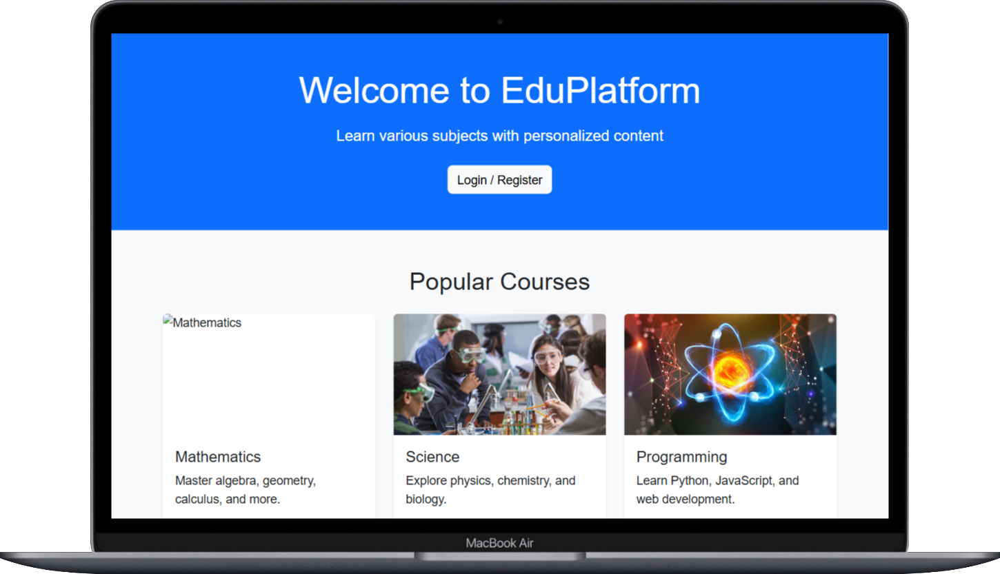

# Educational Web 🌐

**Educational Web** is an interactive platform designed to provide educational resources, courses, and learning tools for students of all ages. The website is user-friendly, responsive, and packed with features to make online learning engaging and effective.

---

## 🌟 Features:
- 📚 Access to a wide range of educational resources.
- 🧑‍🏫 Interactive courses with quizzes and assignments.
- 🌐 Multi-language support for diverse learners.
- 📱 Mobile-first responsive design.
- 📊 Dashboard for tracking learning progress.

---

## 🖼️ Screenshot:
  


---

## 📂 Files Included:
- `index.html`: Main page of the website.
- `style.css`: Custom styling for the platform.
- `app.js`: JavaScript for interactive elements.
- `assets/`: Contains images, icons, and other media files.

---

## 🚀 Live Demo:
[Explore Educational Web Now!](https://e-du.netlify.app/)  


---

## 🛠️ Installation:
1. Clone the repository:
   ```bash
   git clone https://github.com/your-username/educational-web.git
